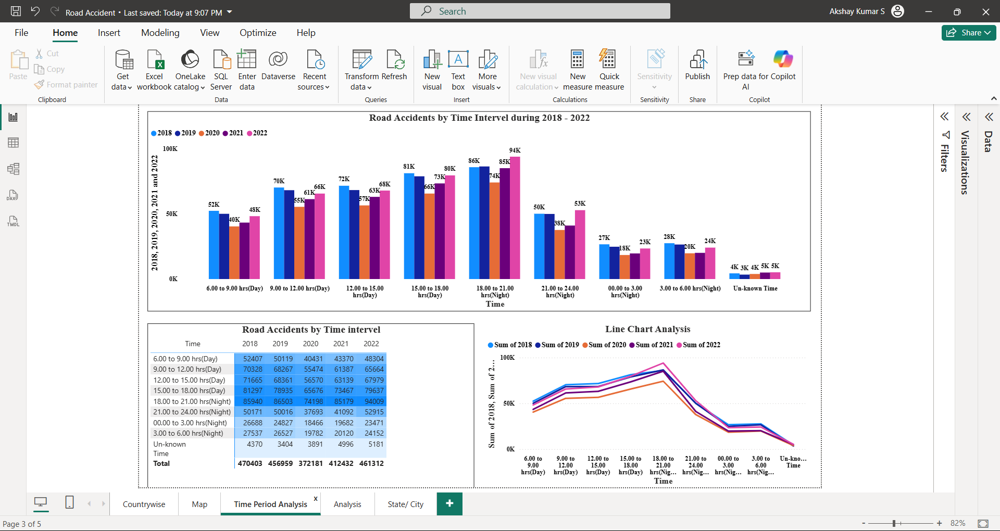

# 🚦 Road Accident Analysis (India 2010–2022)

A **Power BI dashboard** analyzing road accidents across India, with state-wise, city-wise, road categories, and time-trend insights.  
This project is based on the official **Road Accidents in India Report 2022 (MoRTH/NCRB)**.

---

## 📊 Key Insights

- 📈 Accident trends from **2018–2022**  
- 🏙️ **State & City-wise** fatalities and injuries  
- 🛣️ **Time Duration Accident Analysis**
---

## 📁 Repository Structure

road-accident-analysis/
├─ Road Accident.pbix # Power BI dashboard
├─ data/ #cleaned datasets
│ └─ processed/ # CSV/Excel files used in PBIX
├─ images/ # dashboard screenshots
│ ├─ dashboard_overview.png
│ ├─ statewise_trends.png
│ └─ time_analysis.png
└─ README.md # project documentation

---

## 🖼️ Dashboard Preview

### Overview

### Statewise Accident Trends

### Time of Day Analysis

---

## ⚙️ How to Use

1. Download the Power BI file: **`Road Accident.pbix`**  
2. Open it in **Power BI Desktop**  
3. Refresh the dataset if needed  

---

## 📌 Data Source

- Ministry of Road Transport and Highways (MoRTH), **Road Accidents in India 2022**  
- NCRB, Open Government Data ([data.gov.in](https://morth.nic.in/sites/default/files/RA_2022_30_Oct.pdf))  

---

## 👤 Author

**Akshay Kumar S**  
📍 Chennai, India  
🔗 [LinkedIn](https://www.linkedin.com/) | [GitHub](https://github.com/your-username)

---

